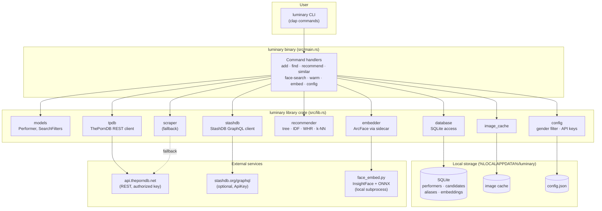
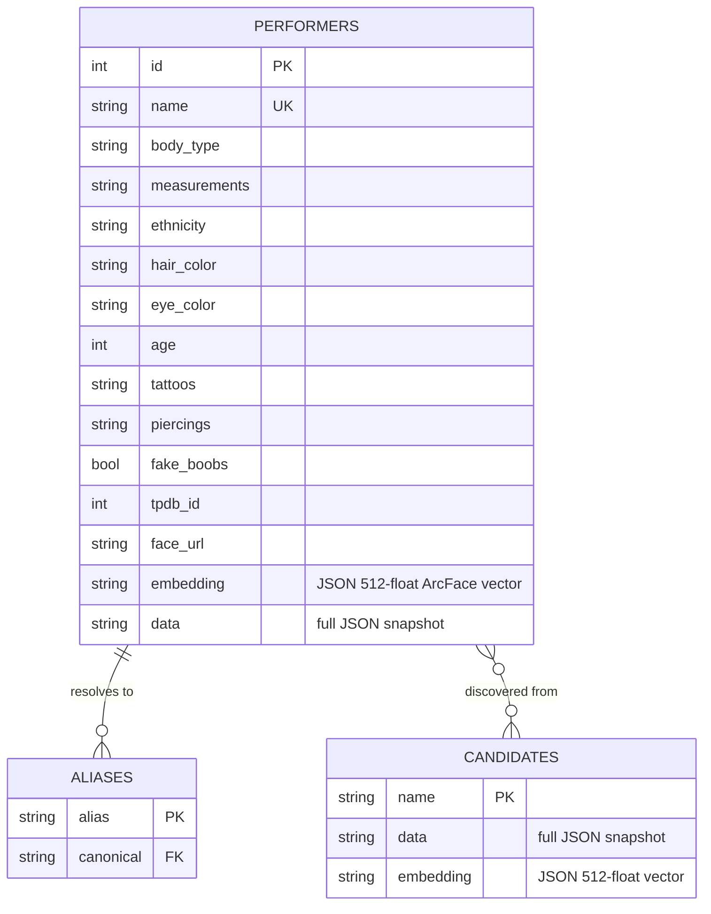
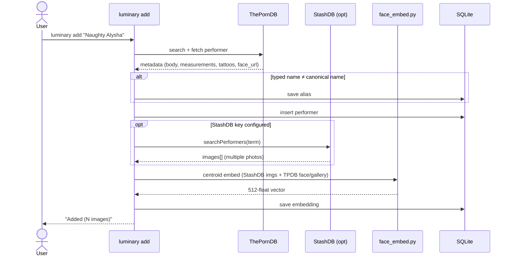
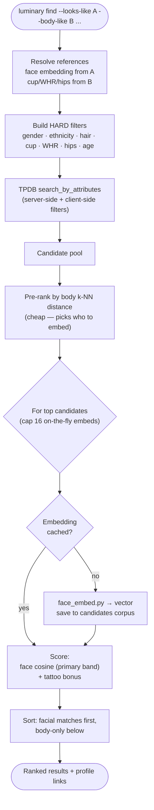
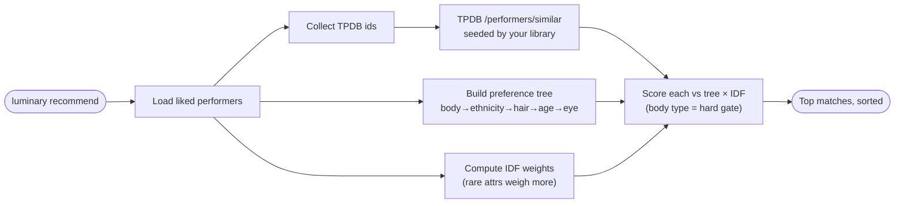
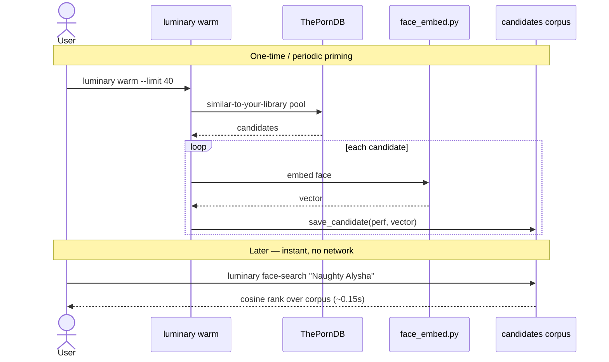
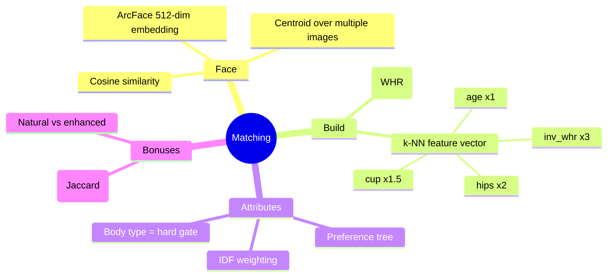
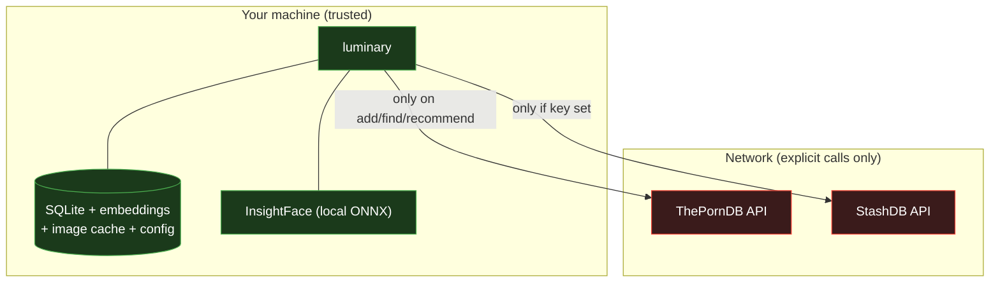

# Luminary — System Design

A privacy-first, local-first recommendation engine for discovering adult
performers, powered by ThePornDB metadata and ArcFace face recognition.
Everything runs on one machine; nothing leaves it except explicit API calls.

---

## 1. High-level architecture

---

## 2. Data model

- **performers** — your liked library; each row carries a cached centroid embedding.
- **candidates** — the local face corpus: every candidate ever embedded during
  `find` / `warm`, reused for instant `face-search`.
- **aliases** — maps a name you type ("Goldie McHawn") to the canonical TPDB name
  ("Goldie Blair").

---

## 3. Workflow: `add` (build your library)

---

## 4. Workflow: `find` (mix-and-match discovery)

The flagship command — combine one performer's face with another's build,
filter on attributes, rank by facial similarity.

**Key rule:** face-bearing candidates are lifted into a higher score band than
body-only ones, so genuine facial similarity always wins — the body filters
constrain *who* is eligible, the face decides the *order*.

---

## 5. Workflow: `recommend` (profile-driven)

---

## 6. Workflow: `warm` + `face-search` (instant face lookup)

---

## 7. Recommendation algorithms

| Signal | Where used | Weighting |
|--------|------------|-----------|
| Body type | recommend (hard gate), find (filter) | excludes if wrong |
| WHR / butt shape | find filter + k-NN | ×3 in feature vector |
| Cup / bust | find filter, similar | ×1.5 |
| Face (ArcFace) | find --looks-like, face-search | primary ranker |
| Ethnicity / age | recommend, find | IDF-weighted |
| Hair / eye | bonuses | small |
| Tattoo (tramp stamp) | find bonus | +5, never required |

---

## 8. Privacy & trust boundaries

- Face embeddings (biometric data) **never leave the machine**.
- Gender filter defaults to biological female and is enforced server- and
  client-side.
- IAFD was rejected as a source: its robots.txt sets `ai-train=no`.

---

## 9. Module responsibilities

| Module | Responsibility |
|--------|----------------|
| `main.rs` | CLI parsing + command handlers (thin) |
| `models` | `Performer`, `SearchFilters`, preference types |
| `database` | SQLite: performers, candidates, aliases, embeddings |
| `tpdb` | ThePornDB REST client + body-type inference |
| `stashdb` | StashDB GraphQL client (image enrichment) |
| `recommender` | preference tree, IDF, WHR, k-NN, scoring |
| `embedder` | ArcFace via `face_embed.py`, cosine math, centroids |
| `config` | gender filter, API keys, key resolution |
| `image_cache` | local image download cache |
| `scraper` | FreeOnes fallback when no API key |
